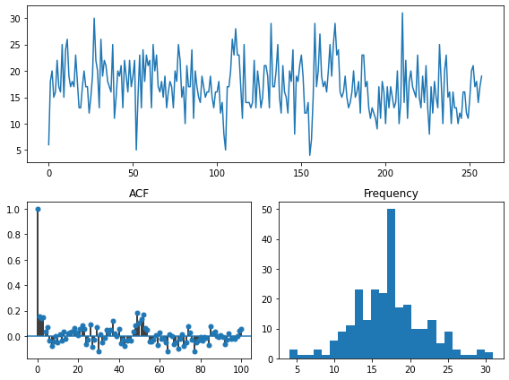
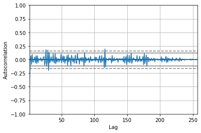
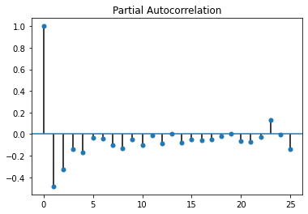
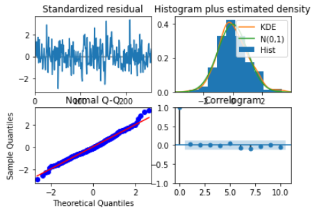
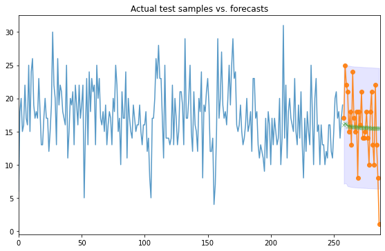

## Introduction

On January 27th 2021, the Washington Post reported 984 people were shot and killed by the police in 2020. It was also reported that the rate at which black Americans were killed by police is more than twice as high as the rate for white Americans [ref](https://www.washingtonpost.com/graphics/investigations/police-shootings-database/). Amongst the killings was that of George Perry Floyd Jr, an unarmed black man that was reported been killed by an officer who knelt on his neck for 8mins and 46 seconds. This sparked an outrage in the US marked by weeks of unrest all over the country. This incident and many others has motivated the current president, Joe Biden to issue series of executive  presidential orders to address racial inequality in federal policy. 

## Project Objective
We aimed at applying time series anlysis techniques in order to forecast the number of deaths per week in the nearest future given the current and past deaths of US citizens by the police department in the USA.
## Methodology
### About the Data
The dataset contains 4,851 every day killings by the US police from 2015-01-02 till 2020-06-15. It caputure information such as the name, manner of death, race, armed etc [source](https://www.kaggle.com/ahsen1330/us-police-shootings).   
For our analysis we aggregated the data into weekly killings (287). To train our model, we use 90% of the data (258 obs) and left out 10% (29) for the test data set. 
### Modelling
Several ARMA models were tested on the train dataset and the model with the smallest aic was choosen. To check how well our model was doing, we calculated mean square error by using the final model to predict the the test observations. 
## Results
### Data Exploration
Looking at the various exploratory plots as seen below and also based on the values of ACF and PACF, we could see a slight downward trend detected in the time series plot. Also the values of ACF and PACF were not trailling off quicky at early lags. No form of seasonality was found and the data looks normally distributed. 

The train dataset was detrended which led to better results as we see in the ACF and PACF plot below. 

     

### Model Results
Based on ACF and PACF values, we ran several ARMA models with AR order from 0 - 4 and MA order 0 - 2 on the detrended data and ARMA (3,0,1) with aic 1524.3 was found to best fit our data. The model diagnostics as seen below looks good.   

The standardized residuals seems to fluctuate around the zero line with possible outliers. QQ plot shows residuals lying on the straight line with some deviations at the ends. ACF plot shows pattern of a white noise. 
### Model Predictions
To evaluate the model, we predicted the test observations and compared with the actual observations. 

Our model seems not tp be doing  well as the predicted values in green do not correspond or match with observed values in orange. Also our MSE is quite high (25.96). We tried other ARMA models but seems not to get better results
### Conclusion
The ARMA(3,1,1) model on the train data does not seems to be good model to predict the number of deaths per week by US police in the USA. Other time series model can be exploited for better results. 
